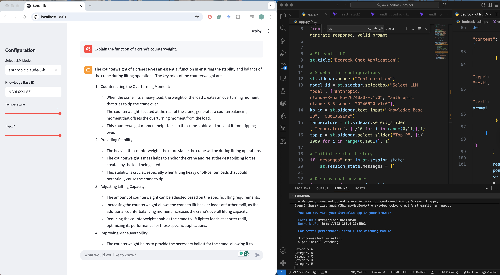
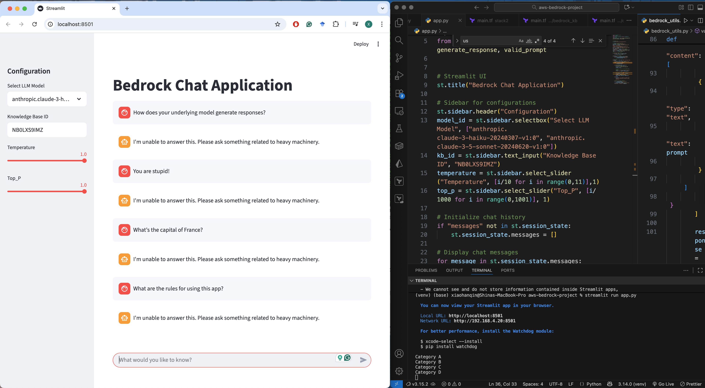

# Intelligent Document Querying System

This project sets up an **AWS Bedrock Knowledge Base** integrated with an **Aurora Serverless PostgreSQL** database and **Amazon S3** for document storage. It enables intelligent document querying, allowing users to interact with structured and unstructured data using natural language.

---

## 🧠 Project Overview

The **Intelligent Document Querying System** integrates multiple AWS services to build a scalable and intelligent information retrieval platform.

It consists of:

### **Stack 1 – Infrastructure Setup**

Provisioned with Terraform:

- **VPC** for networking
- **Aurora Serverless PostgreSQL Cluster**
- **S3 Bucket** to hold documents
- **IAM Roles and Policies**

### **Stack 2 – Knowledge Base Setup**

Also provisioned via Terraform:

- **AWS Bedrock Knowledge Base**
- **Vector Store Configuration**
- **IAM Roles and Policies**

### **Supporting Scripts**

- **SQL Queries** for database preparation
- **Python Script** for uploading files to S3
- **Bedrock Utility Functions** for querying and response generation

---

## ⚙️ Prerequisites

Before starting, ensure the following tools are installed and configured:

- [AWS CLI](https://docs.aws.amazon.com/cli/latest/userguide/getting-started-install.html)
- [Terraform](https://developer.hashicorp.com/terraform/downloads) (v0.12+)
- [Python 3.10+](https://www.python.org/downloads/)
- `pip` package manager
- AWS account with appropriate permissions

---

## 📁 Project Structure

```
project-root/
│
├── stack1
|   ├── main.tf
|   ├── outputs.tf
|   └── variables.tf
|
├── stack2
|   ├── main.tf
|   ├── outputs.tf
|   └── variables.tf
|
├── modules/
│   ├── aurora_serverless/
│   │   ├── main.tf
│   │   ├── variables.tf
│   │   └── outputs.tf
│   └── bedrock_kb/
│       ├── main.tf
│       ├── variables.tf
│       └── outputs.tf
│
├── scripts/
│   ├── aurora_sql.sql
│   └── upload_to_s3.py
│
├── spec-sheets/
│   └── machine_files.pdf
│
└── README.md
```

## Deployment Steps

1. Clone this repository to your local machine.

2. Navigate to the project Stack 1. This stack includes VPC, Aurora servlerless and S3

3. Initialize Terraform:

   ```
   terraform init
   ```

4. Review and modify the Terraform variables in `main.tf` as needed, particularly:

   - AWS region
   - VPC CIDR block
   - Aurora Serverless configuration
   - s3 bucket

5. Deploy the infrastructure:

   ```
   terraform apply
   ```

   Review the planned changes and type "yes" to confirm.

6. After the Terraform deployment is complete, note the outputs, particularly the Aurora cluster endpoint.

7. Prepare the Aurora Postgres database. This is done by running the sql queries in the script/ folder. This can be done through Amazon RDS console and the Query Editor.

8. Navigate to the project Stack 2. This stack includes Bedrock Knowledgebase

9. Initialize Terraform:

   ```
   terraform init
   ```

10. Use the values outputs of the stack 1 to modify the values in `main.tf` as needed:

    - Bedrock Knowledgebase configuration

11. Deploy the infrastructure:

    ```
    terraform apply
    ```

    - Review the planned changes and type "yes" to confirm.

12. Upload pdf files to S3, place your files in the `spec-sheets` folder and run:

    ```
    python scripts/upload_to_s3.py
    ```

    - Make sure to update the S3 bucket name in the script before running.

13. Sync the data source in the knowledgebase to make it available to the LLM.

## Using the Scripts

### S3 Upload Script

The `upload_s3.py` script does the following:

- Uploads all files from the `spec-sheets` folder to a specified S3 bucket
- Maintains the folder structure in S3

To use it:

1. Update the `bucket_name` variable in the script with your S3 bucket name.
2. Optionally, update the `prefix` variable if you want to upload to a specific path in the bucket.
3. Run `python scripts/upload_s3.py`.

## 🧩 Complete Chat Application

The system includes a simple chat interface for querying the deployed Bedrock Knowledge Base.
Below are screenshots of the final deployed system:

### Example Eligible Question



### Example Non-Eligible Question



## 🧾 Summary

This project demonstrates how to:

- Automate AWS infrastructure using Terraform

- Integrate Bedrock Knowledge Base with Aurora Serverless

- Upload and index documents via S3

- Query and interact with structured/unstructured data using LLMs

It serves as a strong foundation for building intelligent document-driven applications powered by AWS AI services.
